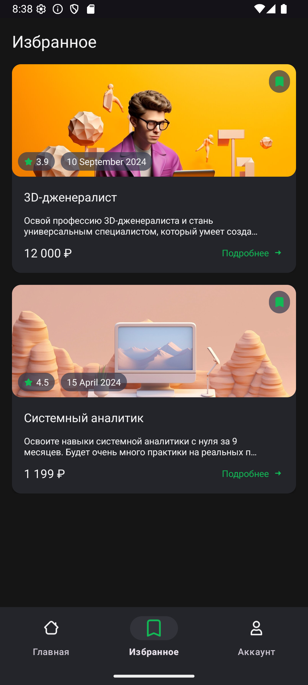

# CourseApp - Тестовое задание от Effective Mobile  

## Описание проекта  

CourseApp — мобильное приложение для просмотра и управления списком курсов.

### Основные экраны:  
1. **Экран входа** — авторизация с валидацией email.  
2. **Главный экран** — список всех доступных курсов.  
3. **Экран избранного** — отображает курсы, добавленные пользователем.  

---

## Технический стек  

| Категория       | Технологии                              |  
|-----------------|-----------------------------------------|  
| Язык           | Kotlin                                  |  
| Архитектура    | Clean Architecture + MVVM               |  
| DI             | Koin                                   |  
| Асинхронность  | Kotlin Coroutines + Flow               |  
| Сеть           | Retrofit                               |  
| База данных    | Room                                   |  
| UI             | XML + AdapterDelegates                 |  

---

## Установка

### Установка из исходного кода:

1. Клонируйте репозиторий:
```bash
git clone https://github.com/DmitriyVladarchuk/CourseApp.git
```

2. Откройте проект в Android Studio:
   - Укажите папку с проектом

3. Настройте среду:
   - Дождитесь завершения синхронизации Gradle

4. Запустите приложение:
   - Выберите эмулятор или подключенное устройство
   - Нажмите "Run" (Shift+F10)

### Установка через APK:
1. Скачайте последний APK из [раздела релизов](https://github.com/DmitriyVladarchuk/CourseApp/releases/)
2. На Android-устройстве:
   - Разрешите установку из неизвестных источников
   - Откройте скачанный APK и подтвердите установку

---

## Скриншоты  

<div style="display: flex; gap: 10px; overflow-x: auto;">
  
  
  
</div>  

---

## Структура проекта

```
app/
├── ui/               # Activity, Fragment, ViewModel
├── di/               # Koin модули
├── views/            # Кастомные View
data/
├── remote/           # Retrofit, API модели
├── local/            # Room Entity, DAO
├── repository/       # Имплементации репозиториев
├── mapper/           # Мапперы между слоями
domain/
├── usecase/          # Бизнес-логика
├── model/            # Domain модели
├── repository/       # Интерфейсы репозиториев
```